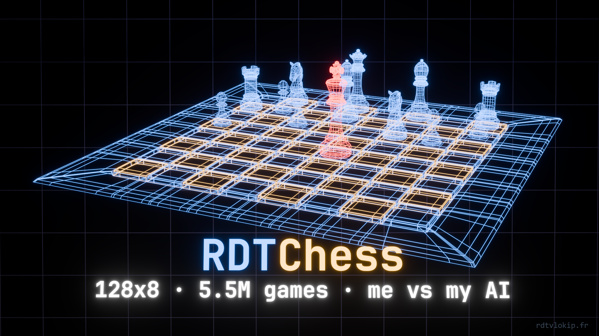

# ♟️ RDTChess



A **10.92M-parameter** residual network that plays chess in **one forward pass** — no search, no MCTS, no opening book. Trained from scratch on a single GTX 1080 Ti by supervised imitation of **5,497,103** human games from Lichess.

[](https://lichess.org/@/RDTChessBot)
[](https://huggingface.co/RDTvlokip/RDTChess)


> ⚠️ **One seed, one run.** Every number below comes from a single training run. Directions are consistent across three independent yardsticks; magnitudes are not multi-seed validated. Read this as a lab notebook, not a benchmark.

This repository holds the **inference code**. The weights live on [Hugging Face](https://huggingface.co/RDTvlokip/RDTChess) — one checkpoint only, the largest-data model of the family. Smaller and differently-shaped siblings were trained alongside it, but none are released, and none of the numbers below come from them.

---

## Play it right now

The model runs live as a Lichess bot: **[lichess.org/@/RDTChessBot](https://lichess.org/@/RDTChessBot)**

Challenge it in bullet, blitz, rapid or classical, casual or rated. Correspondence is declined on purpose — the bot answers in about 7 ms, so a game played over days would tie up a slot for weeks and tell you nothing.

## Run it yourself

```bash
git clone https://github.com/RDTvlokip/RDTChess
cd RDTChess
pip install -r requirements.txt

# the weights are not in this repo (44 MB); pull them from Hugging Face
curl -L -o RDTChess.pt https://huggingface.co/RDTvlokip/RDTChess/resolve/main/RDTChess.pt
```

### Pick a move

```bash
python predict.py                                        # initial position
python predict.py "6k1/5ppp/8/8/8/8/5PPP/R5K1 w - - 0 1" # any FEN
```

```
top 5 moves
  Ra8#      64.3 %
  Ra7       11.4 %
  Re1        5.6 %
```

### Play it in your browser

```bash
python play.py              # you are White, opens http://localhost:8000
python play.py --black
python play.py --port 8080 --depth 3
```

Three modes in the page — play the model, play the minimax, or watch the two of them — plus a depth slider. Standard-library HTTP server, no build step, no CDN.

### As a UCI engine

```bash
python uci.py --model RDTChess.pt
```

Speaks UCI, so it plugs into any interface or into [lichess-bot](https://github.com/lichess-bot-devs/lichess-bot). It reports depth 1 and ignores every time-control parameter, which is the truth rather than modesty: there is no search to budget.

### In your own code

```python
import chess, numpy as np, torch
from encoding import board_to_planes, legal_move_indices
from network import ChessNetwork

model = ChessNetwork.from_checkpoint("RDTChess.pt", device="cpu")
board = chess.Board()

moves, indices = legal_move_indices(board)          # legal moves + their indices
planes = torch.from_numpy(board_to_planes(board)).unsqueeze(0)

with torch.no_grad():
    logits, value = model(planes)

legal = logits[0, torch.as_tensor(indices.astype(np.int64))]
probs = torch.softmax(legal.float(), dim=0).numpy()  # over legal moves ONLY
print(board.san(moves[int(probs.argmax())]), float(value))
```

⚠️ **The one mistake to avoid**: reading `argmax` over the full 4096 logits. About 99 % of them are illegal in any given position. Always gather at `legal_move_indices` first.

`ChessNetwork.from_checkpoint` returns the model already in `eval()` mode. Keep it there — the tower is BatchNorm, and train-mode batch statistics will corrupt single-position inference.

---

## Identity

| | |
|---|---|
| **Architecture** | residual tower, **128 channels × 8 blocks**, two heads |
| **Parameters** | 10.92 M |
| **Input** | 19 planes of 8×8, canonical frame |
| **Policy output** | 4096 raw logits (from-square × 64 + to-square) |
| **Value output** | one scalar in [−1, 1], `tanh` |
| **Search** | **none** — one forward pass per move |
| **Training data** | 5,497,103 Lichess games, both players ≥ 1800 Elo |
| **Positions seen** | 400,581,531, one epoch |
| **Training time** | 12 h 54 on a GTX 1080 Ti |

### The encoding, and why it is shaped this way

Everything lives in a **canonical frame**: the side to move is always "White, playing up the board". When Black is to move, every square is mirrored (`square ^ 56`) and the piece colours swap.

Two consequences, both deliberate:

- the value head always answers **"how good is this for the player to move"**, which is a well-defined question — unlike an absolute encoding, which does not even tell the network whose turn it is;
- a position and its colour-reversed twin share one representation, so every game trains both colours at once.

The 19 planes: 12 for pieces (6 ours, 6 theirs), 4 castling rights, 1 en passant, 1 fifty-move counter, 1 repetition flag.

The policy head emits **logits, not a softmax**. That is what lets the caller mask illegal moves *before* normalising. Softmaxing over all 4096 actions and then zeroing ~99 % of them spends most of the model's capacity learning that illegal moves are illegal — capacity this size cannot spare.

---

## How it was made

**Data.** The Lichess July 2026 standard-game dump. A game is kept when **both** players are rated ≥ 1800 (the filter takes `min(WhiteElo, BlackElo)`), which leaves 5,497,103 games in the 5 GB archive — all of them used. Every position of every kept game becomes one training sample, from the first ply: 400,581,531 positions, seen once.

**Objective.** Plain behaviour cloning. The policy is cross-entropy against the move the human actually played, computed over the legal moves only. The value head regresses the final game result, expressed from the side to move.

**Recipe.** AdamW, learning rate 1e-3, weight decay 1e-4, betas (0.9, 0.999), batch size 512, gradient clipping 1.0, one epoch, no learning-rate schedule.

That is the whole method. No self-play, no MCTS, no distillation from an engine, no opening book, no endgame tablebase.

---

## Evaluation

Three independent yardsticks, because they disagree — and the disagreement is itself a finding.

| yardstick | result | detail |
|---|---|---|
| **Top-1 on held-out human moves** | **51.7 %** | agreement with what the human actually played |
| **vs minimax depth 1** | **88.7 %** | 300 games · +249 =34 −17 |
| **vs minimax depth 2** | **59.5 %** | 300 games · +144 =69 −87 |
| **vs the same net trained on 2M games** | **55.1 %** | 600 games · +35 Elo · p = 0.0034 |

A fixed opponent measures *how well you exploit that opponent*, not general strength: the depth-1 and depth-2 figures move by 29 points for the same model. The head-to-head duel is the most informative of the three.

> 🚫 **No absolute Elo is claimed.** Every Elo figure here is a *difference* measured inside one family of models. The [Lichess bot](https://lichess.org/@/RDTChessBot) is where an absolute rating is being built, game by game.

### Data scaling

| games | net | decade | gain vs d1 | rate |
|---|---|---|---|---|
| 150 k → 1 M | 96×4 | 0.82 | +21.2 pts | 25.7 / decade |
| 1 M → 2 M | 96×4 | 0.30 | +6.3 pts | 20.9 / decade |
| **2 M → 5.5 M** | **128×8** | 0.44 | **+8.0 pts** | **18.2 / decade** |

The rate bends steadily — 25.7, 20.9, 18.2 — without collapsing. The +8.0 was **predicted at +9 before the run** from the two earlier points.

The last row is a wider net than the first two, so the three rates are **not** a single controlled curve: read the bend as a trend, not as a measurement.

---

## What it is good at, and where it breaks

Measured on **23,845 Lichess puzzles**, sampled by cell (solution length × rating band) so that puzzle difficulty is not confounded with solution length. One move per position, no search.

| | |
|---|---|
| first move of the solution | **57.8 %** |
| entire line | **38.3 %** |
| random baseline | 3.6 % (28.0 legal moves on average) |

### The entry move is the hard one

The network is asked at **every** move of the line — even after it has already erred, so that no step is measured on a pre-filtered sample.

| length | accuracy, first move → last |
|---|---|
| 2 moves | 51.9 → **76.1** |
| 3 moves | 53.6 → 67.5 → **85.1** |
| 4 moves | 60.4 → 69.6 → 75.2 → **88.0** |
| 5 moves | 65.5 → 72.5 → 75.5 → 80.3 → **90.6** |

**The entry is the hardest move of every line, by 20 to 35 points. The last is around 90 %, whatever the depth.** Once inside a forcing sequence — recaptures, checks, the mate — the network barely errs. Starting one is the problem.

### And it is the *quiet* entry that breaks

First move found, split by what kind of move it is.

| entry move | <1200 | 1200-1599 | 1600-1999 | 2000-2399 | 2400+ |
|---|---|---|---|---|---|
| check | 74.4 | 59.5 | 47.5 | 39.5 | 51.4 |
| capture | 91.6 | 73.8 | 60.7 | 57.7 | **56.1** |
| quiet | **94.6** | 75.6 | 54.7 | 39.3 | **32.8** |

The quiet move goes from the **easiest** category to the **hardest** — 23 points below captures in the same band — as difficulty rises. Captures and checks are visible in the position; a quiet preparatory move is justified only by what comes three plies later.

> 💡 **In one sentence: this network executes tactics, it does not initiate them.**

---

## Limits — read these before quoting any number

- **It imitates, it does not solve.** The objective is agreement with 1800+ humans. Where those humans are systematically wrong, so is the model, by construction. It is not trying to find the best move; it is trying to find the *likely* move.
- **No search, and it shows.** One forward pass. The puzzle breakdown above locates the cost precisely: 90 % on forced continuations, 32.8 % on quiet entries in hard positions.
- **One seed, one run.** No variance control.
- **Under-promotions cannot be represented.** The action space collapses from/to pairs and always decodes promotions to a queen. This costs well under 0.1 % of moves in normal play, but it makes a handful of knight-promotion puzzles unsolvable *by construction*.
- **No absolute rating.** Do not read "88.7 % against a depth-1 minimax" as an Elo.
- **The value head is weak supervision.** It regresses the final result of the game, which is a very noisy label for a position at move 12.
- **Distribution.** Trained on rated blitz/rapid from one month of one server, at one rating floor. Behaviour outside that distribution — correspondence, odds games, composed positions — is untested.
- **The released weights are the raw supervised checkpoint.** No self-play fine-tuning was applied to it.

---

## What is in this repository

| file | role |
|---|---|
| `network.py` | the architecture |
| `encoding.py` | board ↔ tensor, move ↔ index |
| `player.py` | the network as a player, `get_move(engine)` |
| `engine.py` | board wrapper, canonical encoding, hand-written evaluation |
| `algo_player.py` | alpha-beta minimax, the opponent used in evaluation |
| `gui.py`, `play.py` | the browser board |
| `uci.py` | UCI engine, for lichess-bot and chess GUIs |
| `predict.py` | one-position example |

**Inference only.** The training code is not part of this repository; the recipe above is complete enough to reproduce it.

---

## License

Apache-2.0. See [LICENSE](LICENSE).

## Citation

```bibtex
@misc{charlet2026rdtchess,
  author = {Théo CHARLET},
  title  = {RDTChess: a 128x8 chess policy and value network trained on 5.5M human games},
  year   = {2026},
  publisher = {Hugging Face},
  howpublished = {\url{https://huggingface.co/RDTvlokip/RDTChess}}
}
```

---

**Théo CHARLET**

TSSR Graduate (IT Systems & Networks Technician) — AI/ML Specialization<br>
Creator of AG-BPE (Attention-Guided Byte-Pair Encoding)

[](https://www.linkedin.com/in/théo-charlet)
[](https://rdtvlokip.fr)
[](https://search.rdtvlokip.fr)

🚀 Seeking internship opportunities
